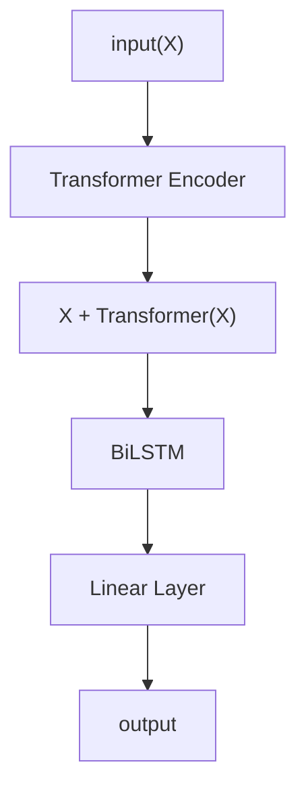

## `BiLSTM.py`

```mermaid
flowchart TD
    start["input(X)"] --> trans[Transformer Encoder]
    trans --> res["X + Transformer(X)"]
    res --> lstm[BiLSTM]
    lstm --> fc[Linear Layer]
    fc --> output[output]
```

output is $x \in \mathbb{R}^{batchsize \times len \times dim}$ as same as input
